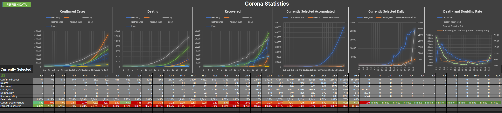

# Current Corona Cases

An Excel Spreadsheet that updates with the current data from John Hopkins [(link to their repo)](https://github.com/CSSEGISandData/COVID-19)
but offers a little more details about the current situation in each country

## Select Countries to Compare

In the section for Confirmed cases just replace any name in the first column with the one you would like to add (needs to be named exactly like in the data from John Hopkins) and charts will be automatically updated. Comparison for

- Confirmed Cases
- Deaths
- Recovered

## Select Country for more details

Under Currently selected find the name of the Country in green. You can then use the dropdown to select one of the countries specified under Confirmed Cases to have a closer look at the situation. Details for a county additionally include

- Cases/Day
- Deaths/Day
- Recovered/Day
- Current Deathrate
- Currend Doubling Rate
- Percentage Recovered

## Deaths and Recoveries

Rows will automatically be filled like the ones under the section Confirmed Cases

### Immediacy of the data

You can always hit Refresh data to get the latest stand from their github database. However this data seems to be a little behind the one on their website and the sheet is not using the REST API which might be a little more up to date. To update your data just click on the green refresh data button
